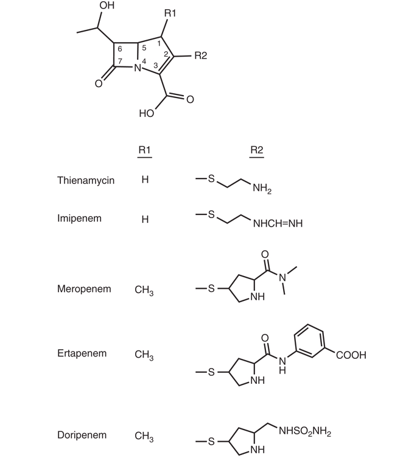
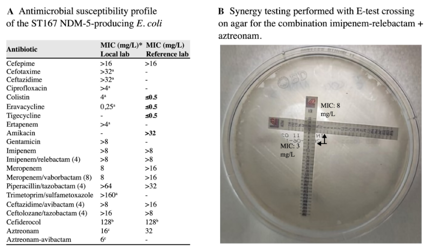
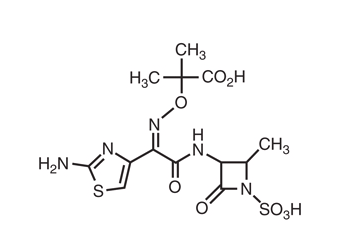

## Carbapenems, <br> Carbapenem/β-Lactamase Inhibitors, <br> and Azteonam {background-video="carbapenems-images/molecule.mp4" background-video-loop="true" background-video-muted="true" background-color="#b20e10"}

<br>

<br> <br>

<center>

**Russell E. Lewis** <br> Associate Professor of Infectious Diseases <br>

<center>

{fig-align="center" width="350"}

<br>  russelledward.lewis\@unipd.it <br>  [https://github.com/Russlewisbo](https://github.com/Russlewisbo/ESCMID_2022_talk) <br> Slides and course materials: [www.idpadova.com](https://padovaid.com/)

## Learning objectives

<br>

- Describe the mechanism of action and structure-activity relationships of carbapenems
- Compare the spectrum of activity, pharmacokinetics, and clinical uses of ertapenem, imipenem, and meropenem
- Explain the role of vaborbactam and relebactam in restoring carbapenem activity
- Identify the resistance mechanisms that limit carbapenem efficacy
- Apply PK/PD principles to optimize carbapenem dosing
- Define the unique role of aztreonam in β-lactam allergy and MBL-producing infections

# Chemistry {background-color="#b20e10"}

## Carbapenem core structure

{fig-align="center" width="300"}

- Derivatives of thienamycin (*Streptomyces cattleya*)
- Differ from penicillins: carbon replaces sulfur at position 1, double bond between C2 and C3
- ***Trans*****-1α-hydroxyethyl side chain at C6 → stability against ESBLs and AmpC β-lactamases**
- The broad spectrum of carbapenems is directly linked to this structural stability

::: aside
[@zhanel2018]
:::

## From thienamycin to clinical agents

<br>

- Thienamycin: too chemically unstable for clinical use
- **Imipenem:** *N*-formimidoyl derivative of thienamycin
  - Degraded by renal DHP-I → requires cilastatin
- **Meropenem & ertapenem:** 1β-methyl substituent at C2
  - Stable to DHP-I → no cilastatin needed
- **Doripenem:** available outside the US

::: aside
Imipenem must always be given with cilastatin. If you see "imipenem" on an order, cilastatin is always included. Meropenem and ertapenem don't need this co-administration.
:::

# Mechanism of Action {background-color="#b20e10"}

## PBP binding profile

<br>

- Carbapenems inhibit cell wall synthesis by binding to PBPs
- Preferential binding: PBPs 1a, 1b, 2, and 4
- Lesser binding to PBP3 (the main target of aminopenicillins and cephalosporins)
- Multi-PBP binding → broad spectrum of activity

::: aside
The binding to PBP2 is particularly important — PBP2 is responsible for maintaining cell shape. Inhibition of PBP2 leads to the characteristic spheroplast formation seen with carbapenem exposure. This multi-target binding is part of why carbapenems maintain activity against organisms resistant to other β-lactams.
:::

## Outer membrane penetration

<br>

- Carbapenems cross the gram-negative outer membrane through specific OMPs
- **OprD** (*P. aeruginosa*): imipenem's primary entry portal
- **OmpK35/OmpK36** (*K. pneumoniae*)
- **OmpC/OmpF** (*Enterobacter* spp.)
- Loss of these porins contributes to resistance

::: aside
Understanding which porins each carbapenem uses is essential for understanding resistance. Imipenem depends heavily on OprD in Pseudomonas, whereas meropenem can use alternative porins. This has direct clinical implications for empiric therapy choices.
:::

## Time-dependent killing

<br>

- Carbapenems display **time-dependent bactericidal activity**
- Key PK/PD parameter: ***f*****T\>MIC**
- Target: 50%–100% of the dosing interval
- Clinical implication: extended or prolonged infusions optimize this target

::: aside
This is a fundamental PK/PD concept for all β-lactams. For carbapenems specifically, we want free drug concentration to exceed the MIC for at least 40-50% of the dosing interval (and some experts advocate for even higher targets in critically ill patients 100% T\>MIC or 100% 4xMIC). Extended infusion strategies directly address this.
:::

# Resistance Mechanisms {background-color="#b20e10"}

## Overview of carbapenem resistance

<br>

Four principal mechanisms:

1.  **β-Lactamase production** (most common in gram-negatives)
2.  **Diminished permeability** (porin loss/modification)
3.  **Efflux pump upregulation**
4.  **Altered PBP targets** (primarily gram-positives)

<br> <br>

::: aside
In clinical practice, resistance is usually multifactorial — a single mechanism rarely confers high-level resistance by itself. The combination of β-lactamase production with porin loss and/or efflux upregulation is the most common scenario for frank carbapenem resistance in gram-negatives.
:::

::: aside
@ma2022
:::

## β-Lactamase-mediated resistance

<br>

- **Class A (KPC carbapenemases):** Serine-based; *K. pneumoniae* carbapenemase is the most important globally

- **Class B (Metallo-β-lactamases/MBLs):** Zinc-dependent; hydrolyze ALL carbapenems; NO clinically available BLI inhibits them

- **Class D (OXA-type):** Found frequently in *A. baumannii*; emerging in Enterobacterales

::: aside
@bush2020; @nordmann2011
:::

::: aside
Class B (MBLs) are the most challenging because no approved BLI works against them — this is where aztreonam combinations become critical. KPCs are inhibited by avibactam, vaborbactam, and relebactam, giving us treatment options.
:::

## Class A carbapenemases: KPC

<br>

::::: columns
::: {.column width="50%"}
- *Klebsiella pneumoniae* carbapenemase (KPC)

- Most important carbapenem resistance determinant worldwide

- Predominantly in *K. pneumoniae*, but spreading to other species

- Inhibited by: avibactam, vaborbactam, relebactam

- **Not** inhibited by: clavulanic acid, tazobactam, sulbactam
:::

::: {.column width="50%"}
:::
:::::

::: aside
@nordmann2011
:::

::: aside
KPC was first identified in North Carolina in 1996 and has since spread globally. It's plasmid-mediated, which facilitates rapid dissemination. The ability of newer BLIs like avibactam and vaborbactam to inhibit KPC has been transformative for treatment of these infections.
:::

## Class B: Metallo-β-lactamases

<br>

- Zinc-dependent enzymes (NDM, VIM, IMP)
- Hydrolyze ALL β-lactams **except aztreonam**
- No clinically available BLI inhibits MBLs
- Treatment strategy: aztreonam + ceftazidime-avibactam
- Intrinsic MBLs in *S. maltophilia*, *E. meningoseptica*

::: aside
Aztreonam is stable against MBLs due to its monobactam structure. But aztreonam alone often fails because MBL-producers frequently co-produce other β-lactamases (like ESBLs or AmpC). The combination with ceftazidime-avibactam provides the avibactam to cover those other enzymes while aztreonam resists the MBL.
:::

## Class D: OXA-type carbapenemases

<br>

- Found predominantly in *Acinetobacter baumannii*
- OXA-48-like enzymes emerging in Enterobacterales
- Generally not inhibited by vaborbactam or relebactam
- Limited treatment options

::: aside
@nordmann2011
:::

::: notes
OXA-48-like enzymes are a particular concern in certain geographic regions, especially the Mediterranean, Middle East, and parts of India. They often produce only modest increases in carbapenem MICs, making detection difficult. Neither vaborbactam nor relebactam has meaningful activity against OXA-48.
:::

## Porin-mediated resistance in *P. aeruginosa*

<br>

- **OprD loss:** Major contributor to carbapenem resistance
- Imipenem: OprD is the primary entry portal → most affected by OprD loss
- Meropenem: less dependent on OprD → less affected
- OprD loss often occurs during therapy

::: aside
@trias1990; @kohler1999
:::

::: aside
This is a common clinical scenario — a patient on imipenem for Pseudomonas develops resistance during treatment due to OprD downregulation. Meropenem may still retain activity in some cases because it uses alternative porins. This differential susceptibility is the basis for the recommendation to use meropenem rather than imipenem as empiric therapy for serious Pseudomonas infections.
:::

## Efflux-mediated resistance

<br>

- **MexA-MexB-OprM** system in *P. aeruginosa*
- Meropenem is a substrate; **imipenem is NOT**
- Upregulation → increased meropenem resistance
- Combined with OprD loss → high-level resistance to both agents

::: aside
@kohler1999; @masuda2000
:::

::: aside
This is an interesting differential: imipenem resistance in Pseudomonas is driven by OprD loss, while meropenem resistance is driven by both OprD loss AND efflux upregulation. This is why you can sometimes see discordant susceptibility — resistant to imipenem but susceptible to meropenem, or vice versa.
:::

## Porin-mediated resistance in enterobacterales

<br>

- **OmpK35/OmpK36** loss in *K. pneumoniae*
- **OmpC/OmpF** loss in *Enterobacter* spp.
- Often combined with β-lactamase production
- Contributes to resistance even without carbapenemase production

::: aside
@davies2011; @yigit2002
:::

::: aside
Non-carbapenemase-mediated resistance in Enterobacterales is increasingly recognized. These organisms may test "resistant" but are not true carbapenemase producers. Understanding this distinction matters for infection control (no need for the same aggressive isolation measures) and for treatment (these organisms may respond to carbapenem-BLI combinations or high-dose carbapenem therapy).
:::

## PBP-mediated resistance in Gram-positives

<br>

- Low-affinity PBP targets → class-wide β-lactam resistance
- **PBP2a** in MRSA → carbapenem resistance
- **PBP5** in *E. faecium* → carbapenem resistance
- 40%–50% of *S. aureus* strains are MRSA
- 60%–80% of *E. faecium* strains are ampicillin-resistant

::: aside
@fuda2004; @weiner2020
:::

::: aside
Carbapenems have NO role in treating MRSA or vancomycin-resistant E. faecium. PBP2a has such low affinity for all β-lactams, including carbapenems, that therapeutic concentrations cannot overcome resistance.
:::

## PBP binding resistance

<br>

::::: columns
::: {.column width="50%"}
- A 65-year-old man without identifiable risk factors for multidrug-resistant pathogens was admitted with peritonitis, isolating NDM-producing *Escherichia coli* from a rectal swab and intraoperative samples.

- After surgery, ceftazidime-avibactam/aztreonam was administered. Due to poor clinical response, he was switched to imipenem-relebactam/aztreonam, resulting in a successful outcome.

- Whole-genome sequencing detected *bla*NDM-5 and *bla*CMY-148 β-lactamases, PBP3 YRIN insertion, and mutated *cirA* gene.

- This case illustrates the importance of considering different mechanisms of resistance when choosing combination therapy.
:::

::: {.column width="50%"}

:::
:::::

::: aside
[@fabrizioOptimizingTargetInactivation2026]
:::

## PBP-mediated resistance in MDR strains

<br>

- **PBP3 four-amino-acid insertions** (typically YRIN or YRIK between residues 333–334 in the β2b–β2c loop, adjacent to the transpeptidase active site) reduce susceptibility to PBP3-targeting β-lactams (aztreonam, cefepime, ceftazidime).

- First described in 2015 with reduced aztreonam–avibactam susceptibility, these insertions are now common in globally disseminated high-risk *E. coli* lineages (ST167, ST405, ST410, ST648), which frequently co-carry NDM metallo-β-lactamases plus CMY cephalosporinases or CTX-M ESBLs.

- Many β-lactams rely predominantly on PBP3 inhibition and are therefore vulnerable to these target alterations; **carbapenems, with broader PBP binding, are less affected — though carbapenem–β-lactamase inhibitor combinations differ in their behavior.**

- Whole-genome sequencing is needed to rapidly detect uncommon resistance genotypes such as PBP3 insertions and guide rational combination therapy.

::: aside
[@stellfox2026]
:::

# Carbapenem-Resistant Enterobacterales {background-color="#b20e10"}

## CRE: A growing threat

::::: columns
::: column
- Increasing incidence of CRE worldwide
- Multiple resistance mechanisms: carbapenemases, porin mutations, ESBL/AmpC + porin loss, efflux
- Detection challenges in routine diagnostic labs
- 2011: CLSI decreased carbapenem breakpoints fourfold
:::

::: column
```{r}
#| label: fig-crkp-europe-map
#| echo: false
#| eval: true
library(sf); library(rnaturalearth); library(leaflet); library(dplyr)

ears <- readr::read_csv("ears_crkp_2024.csv")  # exported from ECDC Atlas
eu <- ne_countries(continent = "Europe", returnclass = "sf") |>
  left_join(ears, by = c("iso_a2" = "country_code"))

pal <- colorBin("Reds", domain = eu$pct_R, bins = c(0,1,5,10,25,50,100))

leaflet(eu) |>
  setView(15, 50, zoom = 4) |>
  addPolygons(fillColor = ~pal(pct_R), fillOpacity = 0.85,
              weight = 0.5, color = "white",
              label = ~sprintf("%s: %.1f%%", name, pct_R)) |>
  addLegend("bottomright", pal = pal, values = ~pct_R,
            title = "CRKP %, 2024")
```
:::
:::::

<br>

::: aside
@nordmann2011; @clsi2011
:::

::: aside
The 2011 CLSI breakpoint change was a landmark decision. By lowering breakpoints, previously "susceptible" isolates with resistance mechanisms were reclassified, allowing clinicians to avoid treatment failures. However, this created confusion in some settings where labs were slow to adopt the new breakpoints.
:::

## Why breakpoints changed

<br>

- Higher 2010 breakpoints missed resistance mechanisms
- Revised breakpoints negate need for routine carbapenemase detection (mCIM, Carba NP)
- **But:** confirming carbapenemase genes may still guide treatment
  - KPC → meropenem-vaborbactam preferred
  - MBL → aztreonam + ceftazidime-avibactam
  - OXA-48 → ceftazidime-avibactam

::: aside
This is the current state of the field — genotypic testing (molecular methods to identify specific carbapenemase genes) is increasingly important for guiding targeted therapy. The MIC alone doesn't tell you which enzyme is present, and the specific enzyme type determines the optimal treatment regimen.
:::

# Carbapenem-BLI Combinations {background-color="#b20e10"}

## Two new combinations

<br>

| Feature | Meropenem-Vaborbactam (Vabomere) | Imipenem-Relebactam (Recarbrio) |
|------------------------|------------------------|------------------------|
| Approval year | 2017 | 2019 |
| BLI class | Cyclic boronic acid | Diazabicyclooctane |
| Inhibits KPC | Yes (potently) | Yes |
| Inhibits AmpC | Yes | Yes |
| Inhibits MBL | No | No |
| Inhibits OXA-48 | No | No |

::: aside
Both agents share the same gap — they don't cover metallo-β-lactamases or OXA-48-type carbapenemases. This is critical for treatment decisions. The key differentiator is their preferred clinical niche: meropenem-vaborbactam for KPC-producers and imipenem-relebactam for difficult-to-treat Pseudomonas.
:::

::: aside
@zhanel2018
:::

## Meropenem-vaborbactam

<br>

- **Dose:** 4 g IV q8h via 3-hour infusion (2 g meropenem + 2 g vaborbactam)
- Vaborbactam designed specifically to bind KPC
- Preferred agent for KPC-producing CRE (IDSA 2023 guidance)?
- Vaborbactam does NOT enhance activity vs *P. aeruginosa* (unless carbapenemase present)
- Dose adjustment based on MDRD formula

::: aside
@tamma2023; @shields2020
:::

::: aside
The TANGO trials established meropenem-vaborbactam for CRE infections. Shields et al. reported early clinical experience showing superiority over best available therapy for CRE bacteremia. The 3-hour infusion is important — it optimizes the PK/PD of both the meropenem and the vaborbactam.
:::

## Imipenem-relebactam

<br>

- **Dose:** 1.25 g IV q6h via 30-minute infusion (500 mg imipenem + 500 mg cilastatin + 250 mg relebactam)
- Relebactam inhibits AmpC → restores imipenem activity vs *P. aeruginosa*
- Emerging role: difficult-to-treat *P. aeruginosa*
- AmpC drives resistance to imipenem more than meropenem
- Can also be used for KPC-producing CRE (less clinical data)

::: aside
AmpC production plays a bigger role in resistance to imipenem vs Pseudomonas than it does for meropenem. So adding relebactam (an AmpC inhibitor) to imipenem specifically addresses this mechanism. The POP study by Reyes et al. highlighted the global epidemiology of carbapenem-resistant Pseudomonas and the importance of knowing which resistance mechanism is present.
:::

::: aside
@tamma2023; @reyes2023
:::

## PK/PD of the BLI components

<br>

- **Vaborbactam:** %fT\>CT is the PK/PD driver; target threshold \~8 μg/mL
- **Relebactam:** AUC/MIC ratio drives efficacy
- Both BLIs require renal dose adjustment
- 3-hour infusion for meropenem-vaborbactam optimizes both components

::: aside
The PK/PD of BLIs is different from the parent β-lactam. For vaborbactam, you need sustained concentrations above a threshold to protect meropenem. For relebactam, total exposure (AUC) relative to the MIC matters. This informs dosing strategies, especially in critically ill patients with altered pharmacokinetics.
:::

::: aside
@griffith2018; @mavridou2015
:::

# Antibacterial activity {background-color="#b20e10"}

## MIC~90~ comparison: Gram-positive cocci

<br>

Comparative Activity of Ertapenem, Imipenem, and Meropenem (MIC~90~, μg/mL)^a^

| Organism                           | Ertapenem | Imipenem  | Meropenem |
|------------------------------------|-----------|-----------|-----------|
| *S. aureus*, oxacillin-susceptible | 0.25      | 0.12      | 0.12      |
| *S. aureus*, oxacillin-resistant   | \>16      | \>16      | \>16      |
| CoNS, oxacillin-susceptible        | 0.25      | 0.12      | 0.12      |
| CoNS, oxacillin-resistant          | \>16      | \>16      | \>16      |
| *Streptococcus pneumoniae*         | 0.06–0.5  | 0.06–0.25 | 0.06–1    |
| β-Hemolytic streptococci           | 0.06      | 0.06      | 0.06      |
| Viridans group streptococci        | 0.12      | 0.03      | 0.03      |
| *Enterococcus faecalis*            | 8         | 1         | 8         |
| *Enterococcus faecium*             | \>8       | \>8       | \>8       |
| *Bacillus anthracis*               | —^b^      | 0.12      | 0.05      |
| *Listeria monocytogenes*           | 0.25      | 0.06      | 0.12      |

## MIC~90~ Comparison: Gram-negative cocci & enterobacterales (1)

<br>

| Organism                           | Ertapenem | Imipenem | Meropenem |
|------------------------------------|-----------|----------|-----------|
| *Haemophilus influenzae*           | 0.03      | 0.25     | 0.06      |
| *Moraxella catarrhalis*            | 0.03      | 0.25     | 0.03      |
| *Neisseria gonorrhoeae*            | 0.06      | 0.25     | 0.03      |
| *Neisseria meningitidis*           | 0.03      | 0.03     | 0.03      |
| *Escherichia coli*                 | 0.06      | 0.5      | 0.03      |
| *Escherichia coli*, ESBL-producing | 0.06      | 0.5      | 0.06      |
| *Salmonella* spp.                  | 0.06      | ≤0.5     | 0.03      |
| *Shigella* spp.                    | 0.06      | ≤0.5     | 0.03      |
| *Klebsiella pneumoniae*^c^         | 0.12      | 0.5      | 0.12      |
| *Klebsiella oxytoca*               | 0.06      | 0.5      | 0.12      |
| *Enterobacter cloacae*             | 0.06      | 0.5      | 0.12      |

## MIC~90~ Comparison: Enterobacterales (2) & Non-fermenters

<br>

| Organism                                  | Ertapenem | Imipenem | Meropenem  |
|----------------------------------|-------------|-------------|-------------|
| *Klebsiella* (*Enterobacter*) *aerogenes* | 0.06      | 0.5      | 0.12       |
| *Morganella morganii*                     | 0.06      | 8        | 0.12       |
| *Citrobacter* spp.                        | 0.06      | 0.5      | 0.12       |
| *Serratia marcescens*                     | 0.06      | 0.5      | 0.12       |
| *Proteus mirabilis*                       | 0.06      | 1        | 0.12       |
| *Aeromonas* spp.                          | 0.25      | 0.5      | 0.12       |
| *Pseudomonas aeruginosa*^c^               | \>8       | 1 to \>8 | 0.5 to \>8 |
| *Acinetobacter baumannii*^c^              | \>8       | \>8      | \>8        |
| *Stenotrophomonas maltophilia*            | \>8       | \>8      | \>8        |
| *Burkholderia cepacia*                    | \>8       | \>8      | 4          |

## MIC~90~ comparison: anaerobes

<br>

| Organism | Ertapenem | Imipenem | Meropenem |
|------------------|------------------|------------------|------------------|
| *Peptostreptococcus* spp. | 0.125 | 0.25 | 0.125 |
| *Fusobacterium* spp. | 0.03 | 0.12 | 0.03 |
| *Bacteroides fragilis* | 0.5 | 0.5 | 0.25 |
| *Clostridium perfringens* | 0.06 | 0.5 | 0.06 |
| *Clostridioides difficile* (formerly *Clostridium difficile*) | 4 | 2 | 2 |

::: aside
^a^ MIC values from Mandell, Douglas, and Bennett's Principles and Practice of Infectious Diseases. ^b^ No data. ^c^ Susceptibility varies widely; values shown represent typical range.
:::

## Gram-positive activity

<br>

- *S. pneumoniae*: MIC \<0.03 μg/mL (penicillin-susceptible), \~0.5 μg/mL (penicillin-resistant)
- β-Hemolytic streptococci: exquisitely susceptible
- MSSA: MIC \<0.5 μg/mL; **MRSA: resistant** (PBP2a)
- *E. faecalis*: susceptible to imipenem (MIC ≤2); resistant to ertapenem/meropenem
- *E. faecium*: resistant to all carbapenems (PBP5)

::: aside
@fritsche2009; @jones2009
:::

::: notes
Key clinical takeaway: if you have a mixed infection with E. faecalis AND gram-negatives, imipenem is the carbapenem of choice because it covers both. Meropenem and ertapenem won't reliably cover E. faecalis.
:::

## Gram-negative activity: Enterobacterales

<br>

- Most inhibited at MIC ≤1 μg/mL for imipenem/meropenem
- Ertapenem MICs typically ≤0.1 μg/mL (including ESBL-producers)
- **Exceptions for imipenem:** *Morganella*, *Providencia*, *Proteus* — higher MICs, CLSI has no breakpoints; relebactam does not restore activity
- KPC-producing *K. pneumoniae*: MIC ≥8 μg/mL → resistant
- KPC-producing *E. coli*: often lower MICs (0.5–4 μg/mL)

::: aside
The discrepancy in MICs between KPC-producing K. pneumoniae and E. coli is clinically relevant. KPC-producing E. coli may appear susceptible at current breakpoints but still harbors the resistance gene. This is one argument for genotypic testing in addition to phenotypic susceptibility testing.
:::

## Gram-negative activity: Non-fermenters

<br>

- *P. aeruginosa*: susceptible to imipenem and meropenem but **NOT ertapenem**
- *A. baumannii*: variable susceptibility; OXA-type carbapenemases common
- *S. maltophilia*: intrinsically resistant (chromosomal MBL-L1)
- *Burkholderia cepacia*: variable

::: notes
Ertapenem has a critical gap in Pseudomonas coverage — this must be remembered when selecting empiric therapy. If Pseudomonas is in the differential, ertapenem is not the right carbapenem. This is a common exam question and clinical pitfall.
:::

## Anaerobic activity

<br>

- Ertapenem and meropenem: excellent anaerobic coverage
- Broad activity against *Bacteroides fragilis* group, *Clostridium* spp.
- Imipenem: good but may have slightly higher MICs for some *Bacteroides*
- No carbapenem active against *Clostridioides difficile*

::: aside
@goldstein2002
:::

::: aside
The strong anaerobic coverage of carbapenems is one reason they are used so effectively for intraabdominal infections and diabetic foot infections. However, broad-spectrum anaerobic coverage also carries the risk of disrupting the gut microbiome and promoting C. difficile infection.
:::

## Other notable activity

<br>

- *Neisseria gonorrhoeae*: highly susceptible; ertapenem activity against ceftriaxone-resistant strains
- *N. meningitidis*: MIC \<0.1 μg/mL
- *H. influenzae*: susceptible including β-lactamase producers
- *Nocardia* spp.: imipenem has best activity
- Mycobacteria: imipenem active against some NTM and *M. tuberculosis*

::: aside
@unemo2012; @cercenado2007
:::

::: notes
The activity of ertapenem against ceftriaxone-resistant N. gonorrhoeae is generating interest as a potential treatment option for MDR gonorrhea, though more clinical data are needed. Imipenem's activity against Nocardia is a unique clinical niche — it's often included in combination regimens for serious nocardiosis.
:::

# Individual Agent Profiles {background-color="#b20e10"}

## Ertapenem: Key features

<br>

- **Once-daily dosing** (1 g IV q24h) — ideal for OPAT
- Long half-life (\~4 hours) due to high protein binding (92%–95%)
- **No activity against:** *P. aeruginosa*, *Acinetobacter*, *Enterococcus*
- Excellent ESBL-producer coverage
- Preferred for community-acquired polymicrobial infections

::: aside
@majumdar2002
:::

::: notes
Ertapenem's niche is clear: it's the carbapenem for infections where you don't need Pseudomonas or Acinetobacter coverage. Its once-daily dosing makes it the best carbapenem for outpatient therapy. Think of it as a broad-spectrum "community" carbapenem vs. meropenem/imipenem as "hospital" carbapenems.
:::

## Ertapenem: Hypoalbuminemia concern

<br>

- 92%–95% protein bound → sensitive to albumin levels
- Hypoalbuminemia → increased free drug → faster renal clearance
- Clinical consequence: subtherapeutic levels despite "adequate" dosing
- Consider alternative carbapenem or TDM in ICU patients with low albumin

::: aside
@zusman2015
:::

::: aside
The Zusman study showed increased mortality with ertapenem vs. other carbapenems in hypoalbuminemic patients. This is a real clinical concern in the ICU. If the patient has albumin \<2.5 g/dL and a serious infection, meropenem is the safer choice.
:::

## Imipenem-cilastatin: Key features

<br>

- Must be coadministered with cilastatin (DHP-I inhibitor)
- **Most frequent dosing:** q6h (less convenient)
- **Highest seizure risk** among carbapenems
- **Unique activity:** *E. faecalis*, *Nocardia*, mycobacteria
- Decreased infusion stability vs. meropenem

::: aside
@drusano1986
:::

::: aside
Imipenem's drawbacks — frequent dosing, seizure risk, infusion instability — explain why meropenem has largely replaced it as the default carbapenem for gram-negative infections. But imipenem retains important niches: E. faecalis coverage, Nocardia, and as the backbone of imipenem-relebactam for DTR Pseudomonas.
:::

## Imipenem: Seizure risk

<br>

- Reported rates: 1%–3% general; up to 10% with risk factors
- Risk factors: renal impairment, CNS pathology, high doses
- Mechanism: GABA receptor antagonism
- Dose reduction in renal impairment is critical
- Meropenem preferred when CNS infection or seizure risk exists

::: aside
@miller2011
:::

::: notes
The seizure risk is dose-related and can be mitigated by proper renal dose adjustment. However, for CNS infections like meningitis, meropenem is the carbapenem of choice — it has better CSF penetration, lower seizure risk, and proven efficacy in this setting.
:::

## Meropenem: Key features

<br>

- **Most versatile carbapenem** for serious infections
- Extended infusion (3 hours) optimizes PK/PD target
- \~2% protein binding → nearly all drug is free
- Half-life \~1 hour with normal renal function
- Good CSF penetration → carbapenem of choice for meningitis
- Can combine total daily dose in 2 bags, infuse each over 12 hours

::: aside
@moon1997
:::

::: aside
Meropenem is the workhorse carbapenem for ICU settings. Its low protein binding means you get what you dose. Extended infusion (3 hours) is now standard practice for serious infections in many centers — this maximizes the time the drug is above the MIC.
:::

## Meropenem: Extended infusion strategy

<br>

- Standard: 1–2 g IV q8h over 30 minutes
- Extended: 1–2 g IV q8h over **3 hours**
- Rationale: increases %fT\>MIC from \~60% to \>90% at standard dose
- Most beneficial for organisms with elevated MICs (4–8 μg/mL)
- Not stable for continuous infusion — use 2 bags over 12h each as alternative

::: aside
@nicolau2008; @abdulaziz2020
:::

::: aside
Extended infusion is particularly important for infections with organisms at the susceptibility breakpoint. For example, a Pseudomonas with a meropenem MIC of 4 μg/mL — standard infusion may not provide adequate time above MIC, but a 3-hour infusion will. Many hospitals have adopted this as default for all ICU patients.
:::

# Pharmacokinetics Comparison {background-color="#b20e10"}

## PK parameters at a glance

<br>

| Parameter         | Ertapenem | Imipenem              | Meropenem |
|-------------------|-----------|-----------------------|-----------|
| Protein binding   | 92%–95%   | \~20%                 | \~2%      |
| Half-life (h)     | \~4       | \~1                   | \~1       |
| Dosing frequency  | q24h      | q6–8h                 | q8h       |
| CSF penetration   | Poor      | Moderate              | Good      |
| DHP-I stability   | Yes       | No (needs cilastatin) | Yes       |
| Renal elimination | Yes       | Yes                   | Yes       |

::: aside
This table highlights why each agent fills a different clinical niche. Ertapenem's long half-life allows once-daily dosing (OPAT-friendly), but its high protein binding is a liability in hypoalbuminemia. Meropenem's low protein binding and good CSF penetration make it ideal for critically ill patients and CNS infections.
:::

## Renal dose adjustment

<br>

- All carbapenems require dose reduction in renal impairment
- **Critical for seizure prevention** (especially imipenem)
- Ertapenem: no adjustment until CrCl \<30 mL/min
- Imipenem: reduce dose AND frequency as CrCl decreases
- Meropenem: extend interval; consider extended infusion maintained

::: notes
Under-dosing in renal impairment is actually less of a concern than over-dosing, because accumulation leads to seizures. Always check renal function before prescribing any carbapenem and adjust accordingly.
:::

# Adverse Effects {background-color="#b20e10"}

## Common adverse effects

<br>

| Effect                 | Ertapenem | Imipenem | Meropenem |
|------------------------|-----------|----------|-----------|
| Diarrhea               | ++        | ++       | ++        |
| Nausea/vomiting        | \+        | ++       | ++        |
| Seizure                | \+        | +++      | \+        |
| Rash                   | \+        | ++       | \+        |
| Transaminase elevation | \+        | ++       | \+        |
| Headache               | \+        | \+       | ++        |

::: aside
Imipenem consistently shows a higher adverse event profile, particularly for seizures and hypersensitivity reactions. This is one of several reasons meropenem has become the preferred carbapenem for most serious gram-negative infections.
:::

## Valproic acid interaction

<br>

- **Class effect** — ALL carbapenems cause precipitous VPA decrease
- Onset: within 24 hours of coadministration
- Mechanism: increased VPA glucuronidation + decreased intestinal absorption
- VPA levels often drop 50%–90%
- **Clinical recommendation:** avoid concomitant use; use alternative anticonvulsant or alternative antibiotic

::: aside
@mori2007
:::

::: notes
This is a critically important drug interaction. Increasing the valproic acid dose will NOT overcome this interaction — the effect is too profound. The only options are to switch the anticonvulsant (e.g., to levetiracetam) or switch the antibiotic. This should be flagged by pharmacy for every carbapenem order.
:::

## β-Lactam cross-allergenicity

<br>

- Carbapenems share the β-lactam core with penicillins
- Cross-reactivity rate: approximately **1%**
- Carbapenems generally safe in penicillin-allergic patients
- Use caution with history of severe (anaphylactic) penicillin allergy
- **Aztreonam:** no cross-reactivity with penicillins/carbapenems
  - Exception: shares side chain with ceftazidime

::: aside
@frumin2009
:::

::: notes
The 1% cross-reactivity rate is reassuring, but it's not zero. In practice, most patients labeled "penicillin allergic" can receive carbapenems safely. Skin testing can help clarify true allergy. Aztreonam is the safest β-lactam option for patients with verified severe penicillin allergy.
:::

# Clinical Applications {background-color="#b20e10"}

## Treatment algorithm: Carbapenem selection

<br>

- **Empiric/broad-spectrum:** Meropenem (extended infusion)
- **Step-down/OPAT:** Ertapenem
- **Mixed GN + *E. faecalis*:** Imipenem
- **KPC-producing CRE:** Meropenem-vaborbactam
- **DTR *P. aeruginosa*:** Imipenem-relebactam
- **MBL producers:** Aztreonam + ceftazidime-avibactam
- **Severe β-lactam allergy + GN coverage:** Aztreonam

::: aside
Each agent has a specific niche based on its spectrum, pharmacokinetics, and the resistance mechanism involved. Knowing which carbapenem to reach for in each clinical scenario is the key practical takeaway from this lecture.
:::

## ESBL-producing enterobacterales

<br>

- Carbapenems remain agents of choice for serious ESBL infections
- **MERINO trial:** meropenem superior to piperacillin-tazobactam for ESBL bacteremia
- Ertapenem suitable for step-down therapy and less severe infections
- Once-daily dosing facilitates OPAT transition

::: aside
@harris2018
:::

::: aside
The MERINO trial was practice-changing. Before this trial, there was debate about whether pip-tazo could be used for definitive treatment of ESBL bacteremia. The trial showed a significant mortality difference favoring meropenem (12.3% vs 3.7%). This settled the debate and established carbapenems as the standard of care for ESBL bacteremia.
:::

## KPC-producing CRE: Preferred agents

<br>

- **First-line:** Meropenem-vaborbactam (IDSA 2023 guidance)
- **Alternative:** Ceftazidime-avibactam
- Vaborbactam designed specifically for KPC binding
- Early clinical data: improved outcomes vs. best available therapy
- Imipenem-relebactam: less clinical data for KPC infections

::: aside
@tamma2023; @shields2020
:::

::: aside
The IDSA guidance hierarchy is important: meropenem-vaborbactam is preferred over ceftazidime-avibactam for KPC-producers because resistance emergence to ceftazidime-avibactam has been documented. Shields et al. showed early clinical benefit with meropenem-vaborbactam for CRE bacteremia.
:::

## Difficult-to-Treat *P. aeruginosa*

<br>

- DTR-PA: resistant to all traditional first-line agents
- **Imipenem-relebactam:** key agent (relebactam inhibits AmpC → restores imipenem activity)
- AmpC overproduction is a major driver of imipenem resistance in *P. aeruginosa*
- Alternative: ceftolozane-tazobactam, ceftazidime-avibactam
- For MBL-producing *P. aeruginosa*: cefiderocol

::: aside
@tamma2023; @reyes2023
:::

::: notes
Difficult-to-treat Pseudomonas is defined as resistant to piperacillin-tazobactam, ceftazidime, cefepime, aztreonam, meropenem, imipenem, ciprofloxacin, and levofloxacin. These are the most challenging infections in clinical practice. Knowing the resistance mechanism is essential for selecting the right agent.
:::

## MBL-producing organisms

<br>

- No available BLI inhibits MBLs
- **Aztreonam:** stable to MBL hydrolysis
- **Aztreonam + ceftazidime-avibactam:** synergistic combination
  - Avibactam protects aztreonam from serine β-lactamases
  - Aztreonam resists MBL hydrolysis
- Cefiderocol: alternative for MBL-producers

::: aside
The aztreonam + ceftazidime-avibactam combination is one of the most elegant examples of rational combination therapy. Each drug covers the other's vulnerability. Aztreonam-avibactam as a single combination product is currently in development and may simplify this approach.
:::

::: aside
@ma2022
:::

# Aztreonam {background-color="#b20e10"}

## Aztreonam: Unique monobactam

<br>

::::: columns
::: {.column width="50%"}
{fig-align="center"}
:::

::: {.column width="50%"}
- Only clinically available monobactam
- **Monocyclic** β-lactam ring (not bicyclic like other β-lactams)
- Minimal cross-allergenicity with penicillins/cephalosporins/carbapenems
- **Spectrum:** aerobic gram-negatives ONLY
- No activity against gram-positives or anaerobes
:::
:::::

::: aside
Aztreonam's unique structure — a single ring rather than the fused bicyclic ring of other β-lactams — is why it doesn't cross-react with penicillin allergy. It's also why it has such a narrow spectrum. Think of aztreonam as an "injectable aminoglycoside alternative" in terms of its gram-negative focus.
:::

## Aztreonam: Dosing and PK

<br>

- **Adult dose:** 2 g IV q8h (consider extended infusion over 3 hours)
- **Pediatric dose:** 30 mg/kg IV q6–8h (max 120 mg/kg/day)
- Higher doses for cystic fibrosis patients
- Adverse effects: rash, diarrhea, transaminase elevation, neutropenia, phlebitis

::: aside
Aztreonam is commonly used in cystic fibrosis patients for Pseudomonas coverage, where higher doses are often needed. The aerosolized formulation (Cayston) is also widely used in CF for chronic Pseudomonas suppression.
:::

## Aztreonam: Clinical niche

<br>

Two primary roles:

1.  **Severe β-lactam allergy** → safe alternative for gram-negative coverage
    - Exception: shares side chain with ceftazidime (cross-reactivity possible)
2.  **MBL-producing infections** → combined with ceftazidime-avibactam
    - Stable to MBL hydrolysis
    - Avibactam covers co-produced serine β-lactamases

::: aside
If a patient has anaphylaxis to penicillin and has a gram-negative infection requiring IV therapy, aztreonam is the answer. If a patient has an NDM-producing K. pneumoniae, the aztreonam + ceftazidime-avibactam combination is the answer. These two scenarios make aztreonam indispensable in the modern antimicrobial armamentarium.
:::

## Aztreonam side chain similarity

<br>

- Similar R1 side chain to **ceftazidime** and **cefiderocol**
- This side chain provides activity vs *P. aeruginosa*
- Cross-allergenicity possible with ceftazidime (but not other cephalosporins)
- Stability to MBLs is due to the monobactam ring, not the side chain

<br> <br>

::: aside
The anti-Pseudomonal activity comes from the side chain (shared with ceftazidime), but the MBL stability comes from the ring structure. Understanding this helps explain why aztreonam works against MBL-producers while ceftazidime does not.
:::

# Putting it all together {background-color="#b20e10"}

## Summary: Choosing the right carbapenem

<br>

| Clinical Scenario        | Preferred Agent       |
|--------------------------|-----------------------|
| ESBL bacteremia          | Meropenem             |
| ESBL step-down/OPAT      | Ertapenem             |
| Mixed GN + *E. faecalis* | Imipenem              |
| KPC-producing CRE        | Meropenem-vaborbactam |
| DTR *P. aeruginosa*      | Imipenem-relebactam   |
| MBL-producing CRE        | Aztreonam + CAZ-AVI   |
| Severe β-lactam allergy  | Aztreonam             |
| Meningitis               | Meropenem             |
| Nocardiosis              | Imipenem              |

::: aside
This summary table is the practical take-home. Each agent fills a specific niche. The choice depends on: (1) the pathogen suspected or confirmed, (2) the resistance mechanism, (3) the site of infection, and (4) patient factors like allergy, renal function, and albumin levels.
:::

## Dosing summary

<br>

| Drug | Adult Dose (Normal Renal Function) | Pediatric Dose (Normal Renal Function) | Package Insert Infusion Time | Stable as Extended (3h) Infusion |
|---|---|---|---|---|
| Imipenem-cilastatin | 0.5 g ^a^ IV q6h or 1 g IV q6–8h (increase to q6h for cystic fibrosis) | 60–100 mg/kg/day divided q6h (max 4 g/day) | 30 minutes | No |
| Imipenem-cilastatin-relebactam | 1.25 g ^b^ IV q6h | Not established | 30 minutes | No |
| Meropenem | 1–2 g IV q8h | 20–40 mg/kg q8h | 30 minutes | Yes |
| Meropenem-vaborbactam | 4 g ^c^ IV q8h | Not established | 3 hours | Yes |
| Ertapenem | 1 g IV q24h | 15 mg/kg/dose q12h | 30 minutes | Yes |

::: aside
*BLI*, β-Lactamase inhibitor. ^a^ Dose is imipenem component. ^b^ Dose is 500 mg imipenem + 500 mg cilastatin + 250 mg relebactam. ^c^ Dose is 2 g meropenem + 2 g vaborbactam.
:::

## Key takeaways

<br>

1.  Carbapenems are **time-dependent killers** — optimize fT\>MIC with extended infusions
2.  Ertapenem has a **narrow niche** (no *Pseudomonas*, no *Acinetobacter*, no *Enterococcus*)
3.  **Know the resistance mechanism** to choose the right agent
4.  KPC → meropenem-vaborbactam; DTR-PA → imipenem-relebactam; MBL → aztreonam + CAZ-AVI
5.  **Avoid carbapenems with VPA** — class-wide interaction
6.  Aztreonam is uniquely safe in **β-lactam allergy** and uniquely active against **MBL-producers**

## Class-wide reminders

<br>

- **ALL carbapenems:** reduce dose in renal impairment
- **ALL carbapenems:** precipitous decrease in VPA levels
- **ALL carbapenems:** time-dependent kill → optimize infusion duration
- **ALL carbapenems:** no activity vs MRSA or VRE
- **ALL carbapenems (except ertapenem):** Pseudomonas activity
- **Neither BLI:** covers MBLs or OXA-48

## References
